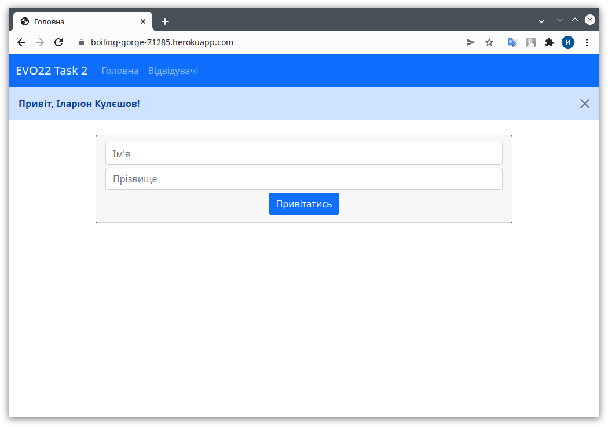

# evo-22-task-2

Тестове завдання №2 для __EVO Python Lab 2022__

Проект розгорнутий на Heroku, доступний за посиланням: https://boiling-gorge-71285.herokuapp.com/

<p align="center">
	
</p>

Проект написаний на Python та Django.

## Обгортка в Docker i розгортка на Heroku

Створення додатку в Heroku CLI:
```
heroku create
```

Отримав назву додатку: __boiling-gorge-71285__

Конфiгурацiя SECRET_KEY (50 рандомних символiв):
```
heroku config:set SECRET_KEY=HgEssKe3i7826cwEXR1dPBDdEnPonVtZgU1wykkEzbKHjFvrGi -a boiling-gorge-71285
```

Вхiд в акаунт Heroku:
```
heroku container:login
```

Створення образа Docker:
```
docker build -t registry.heroku.com/boiling-gorge-71285/web .
```

Завантаження образа Docker на хостинг:
```
docker push registry.heroku.com/boiling-gorge-71285/web
```

Релiз образу:
```
heroku container:release -a boiling-gorge-71285 web
```

Створення бази даних PostgreSQL на Heroku:
```
heroku addons:create heroku-postgresql:hobby-dev -a boiling-gorge-71285
```

Застосування мiграцiй:
```
heroku run python manage.py makemigrations -a boiling-gorge-71285
heroku run python manage.py migrate -a boiling-gorge-71285
```